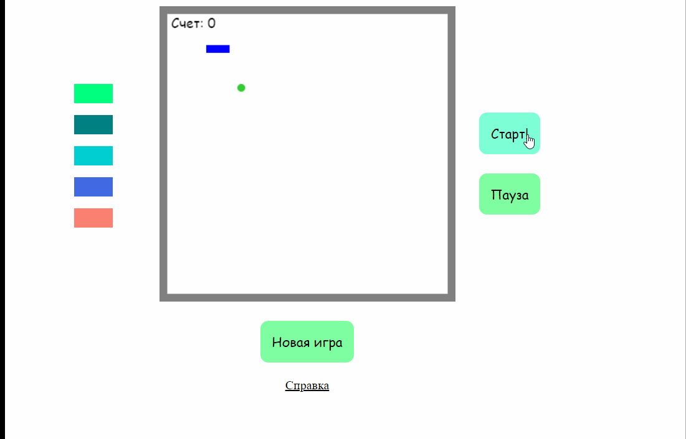

# Snake-game

### Ссылка на прототип:
https://nexuslolz.github.io/snakeGame/

## Preview

## Описание

Реализация популярной игры "Змейка".

В проекте реализовано:
- Главная страница с игрой
- Панель смены цвета Змейки
- Контроллеры (Старт, Пауза, Новая игра)
- Страница со Справкой
- Конец игры наступает при столкновении с бортиком либо с самой собой
- Чем больше счет, тем быстрее Змейка начинает передвигаться

## Особенности проекта

- Змейке можно изменить цвет
- Для отрисовки использован Canvas
- Во время реализации был местами использован JQuery
- Игра адаптирована под мобильные устройства
